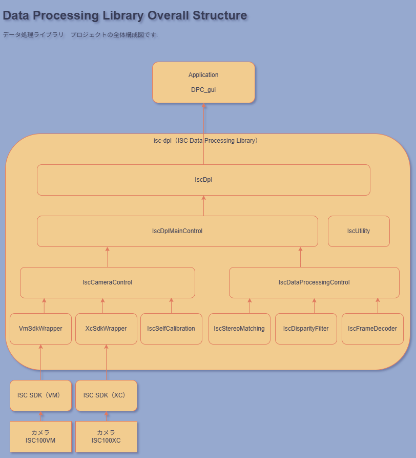

# isc-dpl
Data processing library project for ISC stereo cameras.

****
## Outline 
****
isc-dplは、ISCシリーズのステレオカメラに対応したデータ処理ライブラリと、ライブラリを使用したサンプルプログラムを提供するプロジェクトです。  
データ処理ライブラリには、現在は２つのライブラリが含まれています。  

 - Soft Stereo Matching  
　ステレオマッチングを行います  

 - Frame Decoder  
　カメラ本体又はSoft Stereo Matching出力の視差に対して平均化、補間処理を行います  

本サンプルプログラムを実際のステレオカメラと接続して使用することで、動作の検証が可能となります。  

なお、本プロジェクトにおいてデータ処理ライブラリは、それぞれ以下の名称で提供されています。

| Library              | module(class)    | DLL                  |  
| :------------------- | :--------------- | :------------------- |  
| Soft Stereo Matching | IscBlockMatching | IscBlockMatching.dll |  
| Frame Decoder	       | IscFrameDecoder  | IscFrameDecoder.dll  |  
    
注意  
*Soft Stereo Matchingのアルゴリズムは、ISCシリーズのステレオカメラ本体実装と同一のものではありません*  

****
## Requirements for Windows  
****
- Windows 10(x64)/11  
- Visual Studio 2022 (require MFC)  
- OpenCV 4.7.0 (これ以外のバージョンも動作可能ですが、その場合はbuildの注意を確認してください)  
- ISC Stereo Camrea  
    - ISC100VM: FPGA(0x75)  
    - ISC100XC: FPGA(0x22)  
- ISC Stereo Camera SDK
    - ISC100VM: 2.3.2
    - ISC100XC: 2.2.2

****
# How to build and Run  
****
- OpenCV  
    - [OpenCV official site](https://opencv.org/releases/)よりダウンロードしてください  
      システムの環境変数に次の値を設定してください  
      OpenCV_DIR = C:\opencv\build (your path)

- build  
    - Visual Studioを使用し、プロジェクトをbuildします  
      ソリューションファイルは、build\windows\isc_dpl_all.sln　です  
      実行するプロジェクトは、DPC_guiです  
    - OpenCVのバージョンが4.7.0以外の場合は、リンクしているバージョンを変更してください  
      以下のようにLinkを定義していますので、全て変更してください  
      ```
            #ifdef _DEBUG  
            #pragma comment (lib,"opencv_world470d")  
            #else  
            #pragma comment (lib,"opencv_world470")  
            #endif  
      ```  
    
      設定の必要なファイルは、以下です  
      - source\apps\DPC_gui\DPC_guiDlg.cpp  
      - source\modules\IscBlockMatching\src\isc_blockmatching_interface.cpp  
      - source\modules\IscCameraControl\src\isc_camera_control.cpp  
      - source\modules\IscDataProcessingControl\src\isc_data_processing_control.cpp  
      - source\modules\IscDplMainControl\src\isc_main_control_impl.cpp  
      - source\modules\IscFrameDecoder\src\isc_framedecoder_interface.cpp  
      - source\modules\VmSdkWrapper\src\vm_sdk_wrapper.cpp  
      - source\modules\XcSdkWrapper\src\xc_sdk_wrapper.cpp  


- run  
    - OpenCVのDLLを実行フォルダへコピーします（バージョンはBuildしたOpenCVによります）  
        - Debug Build: opencv_world470d.dll  
        - Release Build: opencv_world470.dll  
    - ISCステレオカメラ用のDLLを実行フォルダへコピーします  
      DLLは、ISC Stereo Camera入手時に同梱されるUSBに含まれています  
      それぞれ必要なDLLの名称は以下です
        - ISC100VM: ISCLibvm.dll, ISCSDKLibvm200.dll  
        - ISC100XC: ISCLibxc.dll, ISCSDKLibxc.dll
    - ISC100XCを使用する場合は、USB 3.0 to FIFO Bridge Chip FT601(FTDI*)のApplication Library(FTD3XX.dll)を実行フォルダへコピーします  
      FTD3XX.dll　は、ISC Stereo Camera入手時に同梱されるUSBに含まれています  
      または、[FTDI official site](https://ftdichip.com/drivers/d3xx-drivers/)より入手可能です  
    - 実行に必要なパラメータファイルを実行フォルダへコピーします  
      source\apps\ParameterFiles　に含まれています

****
## Project structure
****
プロジェクトの全体構成を下図に示します  

- DPC_gui 表示及び各種の制御を行うGUIです  
    
- ISC DPL カメラの制御及びデータ処理を行うライブラリ群です  
    + IscDpl インターフェース用DLLです  
    + IscDplMainControl 全体の制御、データの受け渡しを行います  
    + IScCameraControl 実カメラの制御及びカメラデータのファイル読み書きを行います  
        + VmSdkWrapper SDKとのインターフェースです  
        + XcSdkWrapper SDKとのインターフェースです  
    + IscDataProcessingControl  データ処理ライブラリの呼び出しを行います
        + IscBlockMatching ステレオマッチングを行います  
        + IscFrameDecoder 視差の平均化、補間処理を行います  
    
- ISC SDK(VM/XC) それぞれのカメラに対応したSDKです  

****
## Manuals
****
[DPC_gui操作説明書](./docs/DPC_gui操作説明書.pdf)  
[ISC_DPLモジュール説明書](./docs/ISC_DPLモジュール説明書.pdf)  
[データ処理ライブラリ説明書](./docs/データ処理ライブラリ説明書.pdf)  
[IscDpl API Manual](https://itdlab.github.io/isc-dpl-docs/index.html)  

****
## License  
****
This software is licensed under the Apache 2.0 LICENSE.

> Copyright 2023 ITD Lab Corp. All Rights Reserved.  
>    
> Licensed under the Apache License, Version 2.0 (the "License");  
> you may not use this file except in compliance with the License.  
> You may obtain a copy of the License at  
>    
> http://www.apache.org/licenses/LICENSE-2.0  
>    
> Unless required by applicable law or agreed to in writing, software  
> distributed under the License is distributed on an "AS IS" BASIS,  
> WITHOUT WARRANTIES OR CONDITIONS OF ANY KIND, either express or implied.  
> See the License for the specific language governing permissions and  
> limitations under the License.  
    
****  

*FTDI  
[Future Technology Devices International Limited](https://ftdichip.com/)

*end of document.*  
